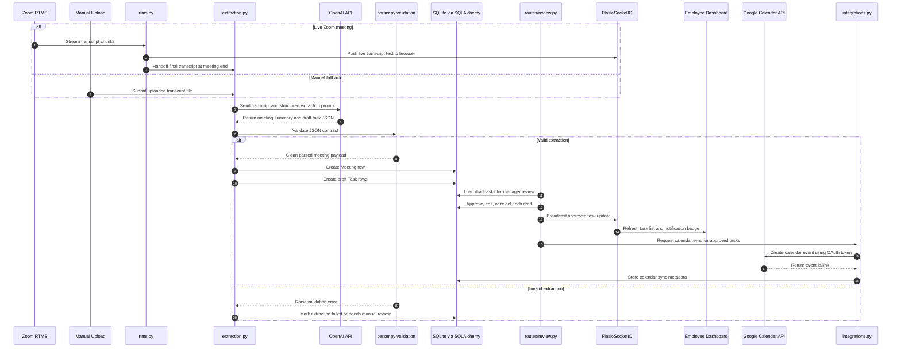

# Nudge

Nudge turns Zoom meeting transcripts into tracked, assigned tasks. It pulls a transcript from Zoom, sends it to OpenAI for structured extraction, lets a manager review and approve what gets created, then syncs deadlines to Google Calendar and keeps everyone's dashboard up to date in real time.

## How It Works

1. **Ingest** — `zoom_client.py` authenticates with Zoom (OAuth) and fetches a meeting transcript, or a sample transcript is loaded locally for dev/demo.
2. **Extract** — the transcript is sent to OpenAI, which returns structured task candidates (owner, description, due date) following the contract in `docs/task_schema.md`.
3. **Review** — a manager reviews extracted tasks on the review screen and approves, edits, or rejects each one.
4. **Sync** — approved tasks are written to the database and pushed to Google Calendar (OAuth) as events with deadlines.
5. **Track** — manager and employee dashboards show task status as a Trello-style board (Pending / Blocked / Done columns), with real-time updates over WebSockets and threaded comments on individual tasks.

## Stack

- **Backend:** Flask, SQLAlchemy, SQLite
- **AI:** OpenAI API (key-based, no OAuth)
- **Integrations:** Zoom API (OAuth), Google Calendar API (OAuth)
- **Frontend:** Jinja templates, vanilla CSS/JS, WebSockets for realtime
- **Deployment:** Vercel container image (`Dockerfile.vercel`, gunicorn + eventlet via `wsgi:app`)
- **Local dev:** `docker-compose.yml` (Flask + SQLite volume)

## Architecture


### Meeting-to-task sequence



## Project Structure

The app is mid-migration from a flat root layout toward a `backend/` package. AI extraction and ingestion already live in `backend/`; the Flask app, routes, and frontend are still at the repo root. Both are tracked below.

```
nudge/
├── app.py                       # Flask app factory + SocketIO init (local dev entrypoint)
├── wsgi.py                      # gunicorn/production WSGI entrypoint (imports create_app)
├── auth.py                      # flask-login setup, manager_required
├── models.py                    # SQLite schema and seed/demo data
├── extraction.py                # configurable transcript extraction + draft persistence
├── integrations.py              # Sprint 2 stubs for calendar invites, .ics, task + reminder emails
├── rtms.py                      # Sprint 2 stub for Zoom RTMS WebSocket handlers
├── sockets.py                   # Sprint 2 stub for SocketIO transcript streaming
├── scheduler.py                 # Sprint 2 stub for daily overdue / due-soon sweep
├── routes/                      # dashboard, review, upload, api blueprints
├── templates/                   # base, login, live, review, manager/employee dashboards (Trello-style board view)
├── static/                      # style.css, live.js (SocketIO client)
├── tests/                       # route, dashboard, auth, draft, extraction persistence tests
├── backend/                     # package-style modules (newer layout)
│   ├── config.py
│   ├── ai/                      # OpenAI client, prompts, schema, parser, extraction
│   ├── ingestion/               # transcript_loader + sample_transcripts/
│   ├── models/                  # SQLAlchemy models: user, meeting
│   └── tests/                   # test_ai_parser.py, test_transcript_loader.py
├── docs/                        # problem statement, sprint plans, task schema, wireframe, architecture.svg
├── Dockerfile                   # Generic/local production image, binds $PORT, runs wsgi:app
├── Dockerfile.vercel            # Primary Vercel container-image entrypoint
├── docker-compose.yml           # local dev convenience (docker compose up)
├── render.yaml                  # Legacy/alternate Render service config
├── pytest.ini                   # scopes test collection to backend/tests + tests
├── requirements.txt
└── .env.example
```

## Setup

```bash
git clone <repo-url>
cd nudge
cp .env.example .env        # fill in Zoom, OpenAI, Google Calendar keys/secrets
```

**Local (venv):**

```bash
python3 -m venv venv && source venv/bin/activate
pip install -r requirements.txt
python -c "from models import init_db; init_db()"   # create + seed nudge.db
python app.py               # or: flask --app app run
```

Then open http://localhost:5000 and sign in with a seeded account —
`maya@nudge.local` (manager) or `marco@nudge.local` (employee), password
`demo1234` (override with `NUDGE_DEMO_PASSWORD`). Reset a password on an
existing database with `python -m scripts.set_password <email> <password>`.

**Local (Docker):**

```bash
docker compose up           # builds the Dockerfile, serves on :5000
```

Required env vars (see `.env.example`): Zoom OAuth client ID/secret, OpenAI API key, Google Calendar OAuth client ID/secret. Set `NUDGE_EXTRACTION_BACKEND=openai` for real transcript extraction; keep `deterministic` for local sample/demo runs without network credentials.

Production deploys on Vercel using `Dockerfile.vercel`. The container runs
`python -m scripts.init_db` before starting `gunicorn --worker-class eventlet`
against `wsgi:app`, and exposes `/healthz` for health checks.

Vercel deployment notes:

- Vercel detects `Dockerfile.vercel` and builds it as a container-image function.
- The container starts with `python -m scripts.init_db` and then runs `gunicorn --worker-class eventlet -w 1 -b 0.0.0.0:${PORT} wsgi:app`.
- `NUDGE_DB_PATH=/var/data/nudge.db` is the runtime SQLite location. Treat this as instance-local unless Vercel persistent storage is explicitly attached/configured.
- The app exposes unauthenticated `GET /healthz` for container health checks.
- Configure Vercel environment variables for `SECRET_KEY`, `ZOOM_CLIENT_ID`, `ZOOM_CLIENT_SECRET`, `ZOOM_SECRET_TOKEN`, `OPENAI_API_KEY`, `GOOGLE_CLIENT_ID`, `GOOGLE_CLIENT_SECRET`, optional `SENDGRID_API_KEY`, and optionally `PUBLIC_BASE_URL=https://<your-domain>` and `NUDGE_SEED_DEMO_DATA=false`.

> **Realtime caveat:** SocketIO live updates need a persistent, WebSocket-capable
> process. Vercel's serverless model does not hold long-lived connections, so the
> HTTP app works there but realtime push may silently fall back to polling or fail.
> For working realtime, deploy the same image to a persistent container host — the
> committed `render.yaml` (a Render Docker web service) runs it as-is.
- The Vercel image defaults to port `80`; if you override `PORT` in Vercel, the container will bind to that value.
- Register these OAuth callback paths with the deployed Vercel domain: `/auth/zoom/callback` and `/auth/google/callback`.
- Test locally with Docker before deploying:

```bash
docker build -f Dockerfile.vercel -t nudge-vercel .
docker run --rm -p 10000:80 --env-file .env nudge-vercel
curl http://localhost:10000/healthz
```

`render.yaml` remains in the repo as an alternate/legacy Docker service config,
but Vercel is the current production deployment target.

## Tests

```bash
pytest                      # 32 tests (pytest.ini collects backend/tests + tests)
```

## Authentication

Two OAuth-authorized integrations:

- **Zoom** — authorizes transcript retrieval (`ingestion/zoom_client.py`)
- **Google Calendar** — authorizes pushing task deadlines as events (`calendar_integration/google_client.py`)

OpenAI API access is key-based rather than OAuth, so it sits outside the "APIs with authorization" bucket but remains the core AI differentiator for task extraction.

## Team Ownership

| Owner | Responsible for |
|---|---|
| **Dev A** | Ingestion (`ingestion/`) and AI extraction (`ai/`) |
| **Dev B** | Models, routes, Google Calendar integration, and realtime sockets |
| **Dev C** | Frontend — templates, CSS/JS, dashboard rendering |

Current tests cover backend AI parser validation, transcript loading, authentication guards, review approvals/edits/rejections, manager and employee dashboard filtering, calendar stub IDs on approval, draft rejection behavior, and the no-Zoom sample transcript path that creates a meeting summary plus draft task rows.

Remaining intentional Sprint 2 stubs:

- `routes/api.py` task mutation, blocker, job status, and notification badge endpoints.
- `rtms.py` live Zoom RTMS meeting lifecycle handlers.
- `sockets.py` realtime transcript/client update emission.
- `scheduler.py` overdue and due-soon notification sweep.
- `integrations.py` Google Calendar OAuth calls and task/reminder email delivery.

## Timeline

Built over 8 working days (Fri Jul 3 – Fri Jul 10), split into 3 sprints plus a buffer/demo-prep block. See `docs/sprint1_plan.md` through `docs/sprint3_plan.md` and `docs/standup_notes.md` for details.
