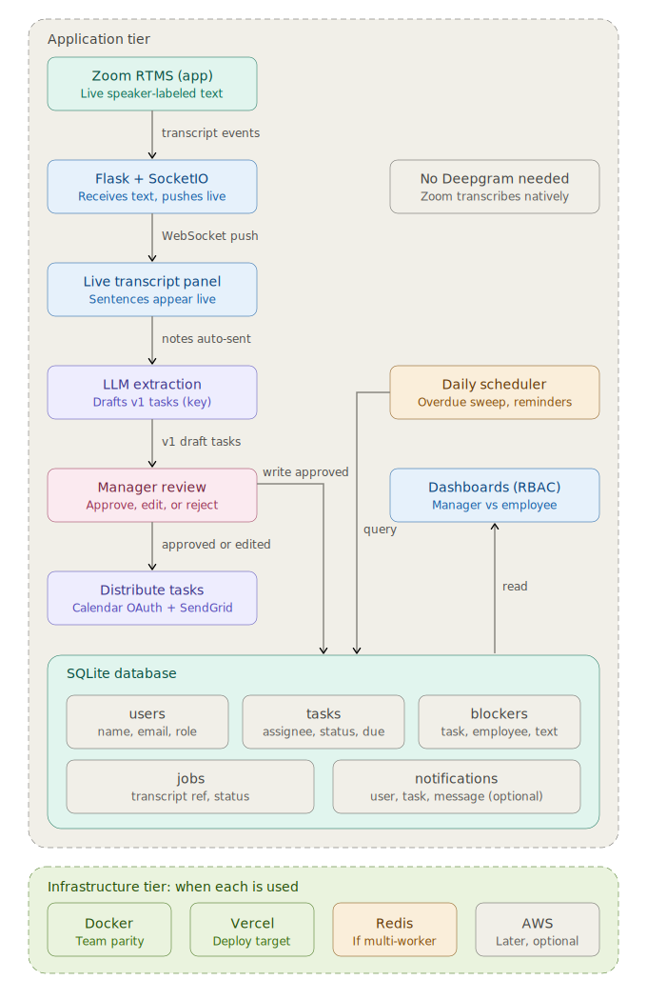

# Nudge

Nudge turns Zoom meeting transcripts into tracked, assigned tasks. It pulls a transcript from Zoom, sends it to OpenAI for structured extraction, lets a manager review and approve what gets created, then syncs deadlines to Google Calendar and keeps everyone's dashboard up to date in real time.

## How It Works

1. **Ingest** — `zoom_client.py` authenticates with Zoom (OAuth) and fetches a meeting transcript, or a sample transcript is loaded locally for dev/demo.
2. **Extract** — the transcript is sent to OpenAI, which returns structured task candidates (owner, description, due date) following the contract in `docs/task_schema.md`.
3. **Review** — a manager reviews extracted tasks on the review screen and approves, edits, or rejects each one.
4. **Sync** — approved tasks are written to the database and pushed to Google Calendar (OAuth) as events with deadlines.
5. **Track** — manager and employee dashboards show task status as a Trello-style board (Pending / Blocked / Done columns), with real-time updates over WebSockets and threaded comments on individual tasks.

## Stack

- **Backend:** Flask, SQLAlchemy, SQLite
- **AI:** OpenAI API (key-based, no OAuth)
- **Integrations:** Zoom API (OAuth), Google Calendar API (OAuth)
- **Frontend:** Jinja templates, vanilla CSS/JS, WebSockets for realtime
- **Deployment:** Docker, Render (`render.yaml`)
- **Local dev:** `docker-compose.yml` (Flask + SQLite volume)

## Architecture



## Project Structure

```
nudge/
├── backend/
│   ├── app.py                  # Flask app factory
│   ├── wsgi.py                 # gunicorn entrypoint
│   ├── config.py
│   ├── models/                 # SQLAlchemy models: user, meeting, task, comment
│   ├── ingestion/               # Zoom OAuth + transcript fetch/loading
│   ├── ai/                      # OpenAI client, prompts, schema, parsing
│   ├── calendar_integration/    # Google OAuth flow + calendar sync
│   ├── routes/                  # auth, meetings, tasks, comments
│   ├── realtime/                # WebSocket events
│   └── tests/                   # unit tests
├── frontend/
│   ├── templates/                # base, manager review, manager/employee dashboards (Trello-style board view)
│   └── static/                   # css, js (task cards, comment threads, sockets)
└── docs/
    ├── task_schema.md            # OpenAI output ↔ DB contract
    ├── architecture.svg          # system diagram: live capture → approval → distribution
    ├── wireframe.png
    ├── standup_notes.md
    └── sprint1_plan.md / sprint2_plan.md / sprint3_plan.md
```

## Setup

```bash
git clone <repo-url>
cd nudge
cp .env.example .env        # fill in Zoom, OpenAI, Google Calendar keys/secrets
docker-compose up           # local dev: Flask + SQLite
```

Required env vars (see `.env.example`): Zoom OAuth client ID/secret, OpenAI API key, Google Calendar OAuth client ID/secret.

Production deploys via `Dockerfile` + `render.yaml` on Render.

## Authentication

Two OAuth-authorized integrations:

- **Zoom** — authorizes transcript retrieval (`ingestion/zoom_client.py`)
- **Google Calendar** — authorizes pushing task deadlines as events (`calendar_integration/google_client.py`)

OpenAI API access is key-based rather than OAuth, so it sits outside the "APIs with authorization" bucket but remains the core AI differentiator for task extraction.

## Team Ownership

| Owner | Responsible for |
|---|---|
| **Dev A** | Ingestion (`ingestion/`) and AI extraction (`ai/`) |
| **Dev B** | Models, routes, Google Calendar integration, and realtime sockets |
| **Dev C** | Frontend — templates, CSS/JS, dashboard rendering |

Tests are split across all three: `test_ai_parser.py`, `test_zoom_client.py` (Dev A), `test_calendar_sync.py`, `test_task_endpoints.py`, `test_meeting_endpoints.py` (Dev B), `test_dashboard_render.py` (Dev C).

## Timeline

Built over 8 working days (Fri Jul 3 – Fri Jul 10), split into 3 sprints plus a buffer/demo-prep block. See `docs/sprint1_plan.md` through `docs/sprint3_plan.md` and `docs/standup_notes.md` for details.
