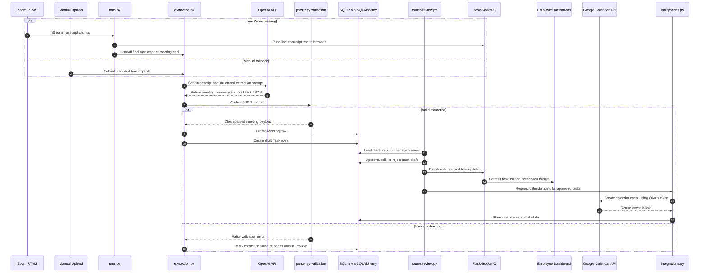
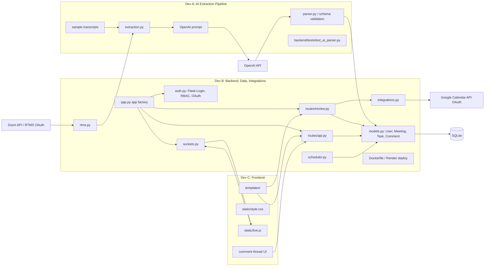

# System Diagram

This document gives the team a text-based system diagram that renders directly in GitHub using Mermaid.

## Full Meeting-To-Task Sequence

## Component Architecture

## Authorized API Integrations

Nudge uses at least two external APIs that require authorization.

| API | Auth type | Owner | Used for | Key files |
| --- | --- | --- | --- | --- |
| Zoom API / RTMS | OAuth | Dev B | Live transcript stream and meeting handoff | `auth.py`, `rtms.py` |
| Google Calendar API | OAuth | Dev B | Calendar events for approved tasks | `auth.py`, `integrations.py` |
| OpenAI API | API key | Dev A | Transcript parsing and task extraction | `extraction.py`, `backend/ai/llm_client.py` |

TODO: Fill in exact OAuth scopes after the final Zoom and Google app configuration is created.

## Data Flow Notes

- Live transcript text can be pushed to the browser while the meeting is active, but only the final transcript should trigger task extraction.
- OpenAI output must pass parser validation before database writes.
- Manager approval is the boundary between "draft AI suggestion" and "real assigned task."
- Google Calendar sync should happen only after approval.
- SocketIO should broadcast task changes to manager and employee dashboards after approval, completion, blocker updates, and comments.

